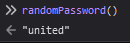

<!-- @format -->

# PassWORLDE

CTF Event: AddaCTF
Category: Reversing
Difficulty: Easy
Platform: CTFtime
Status: Rooted/Finished
Tags: brute-force

## Description

> Have fun playing passWORDLE! Can you guess the passWORDLE for 10.10.2022?

## Steps

By observing the files attached to the challenge we find an html page that asks for an input which is hashed and compared against a chosen random password

```jsx
let attempt = 0;
window.onload = async function () {
	let answer = await hash(randomPassword());
	let input = document.getElementById("input");
	let judge = document.getElementById("judge");
	judge.addEventListener("click", () => {
		judgeEvent(answer, attempt++);
	});
	input.addEventListener("keydown", (ev) => {
		if (ev.code === "Enter") {
			judgeEvent(answer, attempt++);
		}
	});
	let output = document.getElementById("output");
	for (let i = 0; i < MAX_ATTEMPT; ++i) {
		let length = 64;
		let dummy = "_".repeat(length);
		let empty = Array.from({ length }, () => EMPTY);
		output.innerHTML += `<div id="attempt-${i}">${colorize(
			dummy,
			empty
		)}</div>`;
	}
	input.focus();
};
```

Upon further inspection of the `randomPassword` function, we can see that the password is not really random but it is calculated based on the current date

```jsx
function randomPassword() {
	const offsetFromDate = new Date(2022, 0, 1);
	const msOffset = Date.now() - offsetFromDate;
	const dayOffset = msOffset / 1000 / 60 / 60 / 24;
	const res = targetWords[Math.floor(dayOffset)];
	return res;
}
```

We also got a hint about the date 10-10-2022
so we just need to edit the date offset from `Date.now()` to the 10th of October 2022 and call the `randomPassword` function in the console

```jsx
function randomPassword() {
	const offsetFromDate = new Date(2022, 0, 1);
	const msOffset = new Date(2022, 9, 10) - offsetFromDate;
	const dayOffset = msOffset / 1000 / 60 / 60 / 24;
	const res = targetWords[Math.floor(dayOffset)];
	return res;
}
```



now we just need to encapsulate the string in the flag format and submit

## Flag

`ctf{united}`
