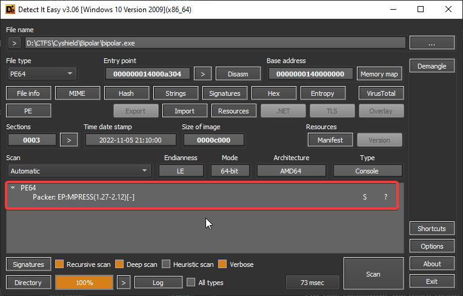

<!-- @format -->

# Bipolar

CTF Event: CyCTF
Category: Reversing
Difficulty: Medium
Status: Rooted/Finished
Tags: EP:MPRESS, Packed PE

## Description

>

## Steps

For this challenge, we were given a 64bit PE. opening the PE in Detect-it-easy reveals that it was packed using `EP:MPRESS(1.27-2.12)[-]`



so we will, unfortunately, have to manually undo the packing with Scylla and IDA

by following a guide we managed to find a guide on the [Reverse Engineering Stack Exchange](https://reverseengineering.stackexchange.com/questions/30545/how-do-i-unpack-a-file-protected-by-mpress) 🤓

we were able to unpack the PE through the following steps:

1- We first need to put a breakpoint at the first line in the assembly


then run the debugger


2- Next we need to step over twice by pressing `F8` and then opening the `RSP` register window


then we should add a hardware breakpoint at the `RSP` register


and click `F9` to continue execution until it hits the Hardware Breakpoint

3- Now we should open Scylla and select the process and click dump


We can now safely close IDA and reopen it with the new dumped PE

> note: to verify that you successfully extracted the PE check if the size changed :)


## Solution

When opening the dumped PE in IDA and go to the `main` function. we will notice that a function is called which probably prints the string `[+] Checking the presence of a debugger`


we will also notice that there is a massive series of `test eax,eax` and `cmp eax,1`


which when viewed as pseudocode looks like they all belong to the same IF condition


when tracing the if condition we see that if the condition returns True it calls the same function in line 7 with the string `Debugger Detected!` and returns `0xDEAD` and if the condition is False it calls the same function in line 7 with the string `No Debugger Found!` and returns `0x1337`


With that information, the IF condition seems obnoxiously long and useless with all these ORs one would assume that it would always be True.

but in the Assembly code, we see that it is either testing EAX with itself (which always will return 1) or comparing it to 1 which looked like binary to me. So I copied all the assembly instructions for the condition and put them in CyberChef to clean them up a bit with Regex and replace all the `test eax,eax` to 1s and all the `cmp eax,1` with 0s


resulting in the binary

```
101111001000011010111100101010111011100110000100101111001100111110110001101110111100111010101011101101101011000010110001101000001011110111001011101011001100110010111011101000001011110111001110101100011010110110100110101000001011101010110001101111001100111110111011110011001011101110100000110010101100100010101101110011101011000110111000101011001010000011001011101000001010101110110111110011001010000010101000110011101011000110000010
```

After a bit of playing around with the binary and trying ciphers and operations and encodings

bit-shifting to the right with 1 revealed the flag 🏆


## Flag

`CyCTF{C0ND1TION_B4S3D_B1NRY_ENC0D3D_57R1NGS_4_TH3_W1N}`
