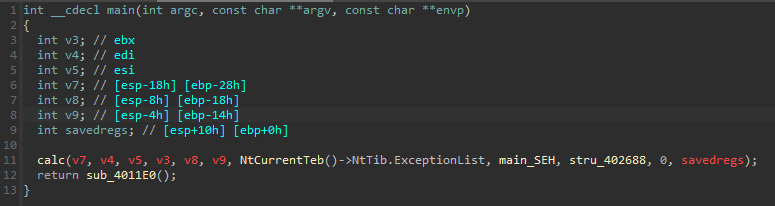

<!-- @format -->

# Deviation

CTF Event: CyCTF
Category: Reversing
Difficulty: Easy
Status: Rooted/Finished

## Description

>

## Steps

in this challenge, we are given a 32bit PE to reverse, opening the PE in IDA we can see that the main function calls another function then returns a function

Upon viewing the first function we notice that it is basically a calculator application that takes input from a user and prints the output of the operation

Taking a look at the other function we can see that a forloop is looping on a variable and XORing it with `0x99` then printing the result as a character

## Solution

Copying the values in the variable `byte_4021C0` into CyberChef and XORing the values with `0x99` reveals the flag

## Flag

`CYCTF{UND3RST4ND1NG_H0W_S3H_W0RK5_1S_ESS3NTI4L}`
