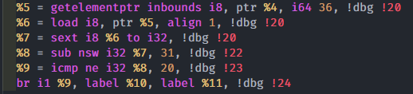
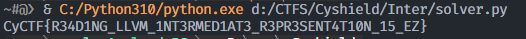

<!-- @format -->

# Inter

CTF Event: CyCTF
Category: Reversing
Difficulty: Easy
Status: Rooted/Finished
Tags: LLVM IR

## Description

>

## Steps

For this challenge, we are given an LLVM IR. Opening this challenge in a code editor we noticed a pattern where the same 7 lines were repeated but with slight and subtle changes in the midst

taking a repetition of that code and reversing it might give us an idea of how to get the flag



by checking the LLVM IR documentation we can see that the 5th line compares the value of the variable `%8` with the value int32 20

and the line before it does a substitution operation on the variable `%7` with the value 31

## Solution

By assuming that calculating `20+31` which gives us 51 which is ASCII for `3` . Repeating the process for the rest of the variables gives us a weird and messy string

```python
import re

ops = {
    "add": lambda x, y: y - x,
    "sub": lambda x, y: x + y,
    "mul": lambda x, y: y / x,
    "xor": lambda x, y: x ^ y,
}

# read the file
with open("./Inter/inter.ll") as f:
    lines = f.read()
    lines = lines.split("\n")

# grep the instructions
instructions = []
for line in lines:
    res = re.search(r"(sub|icmp|add|mul|xor).*", line)
    if res:
        op = res.group(1)
        text = res.group(0)
        num = int(re.search(r"\s\d+,", text).group().strip().strip(","))
        instructions.append((op, num))

for i in range(0, len(instructions), 2):
    op, num = instructions[i]
    op2, num2 = instructions[i + 1]
    res = int(ops[op](num, num2))
    print(chr(res), end="")
```


the result string looks like a flag but does not seem to be in the correct order. We then realize that the 1st line in the first screenshot might have to do with the position of each character


We just need to adjust our script to get the correct order and get the flag :D

```python
import re

ops = {
    "add": lambda x, y: y - x,
    "sub": lambda x, y: x + y,
    "mul": lambda x, y: y / x,
    "xor": lambda x, y: x ^ y,
}

# read the file
with open("./Inter/inter.ll") as f:
    lines = f.read()
    lines = lines.split("\n")

# grep the instructions
next_pos = 0
instructions = []
for line in lines:
    if re.search(r"getelementptr", line):
        next_pos = int(re.search(r"\s\d+,", line).group().strip().strip(","))

    res = re.search(r"(sub|icmp|add|mul|xor).*", line)
    if res:
        op = res.group(1)
        text = res.group(0)
        num = int(re.search(r"\s\d+,", text).group().strip().strip(","))
        pos = next_pos
        next_pos = 0
        instructions.append((op, num, pos))

flag = [""] * 100
for i in range(0, len(instructions), 2):
    op, num, pos = instructions[i]
    op2, num2, _ = instructions[i + 1]
    res = int(ops[op](num, num2))
    flag[pos] = chr(res)

print("".join(flag))
```



## Flag

`CyCTF{R34D1NG_LLVM_1NT3RMED1AT3_R3PR3SENT4T10N_15_EZ}`
